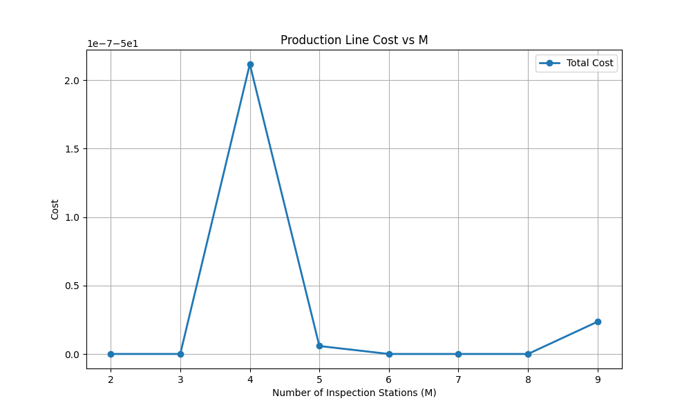
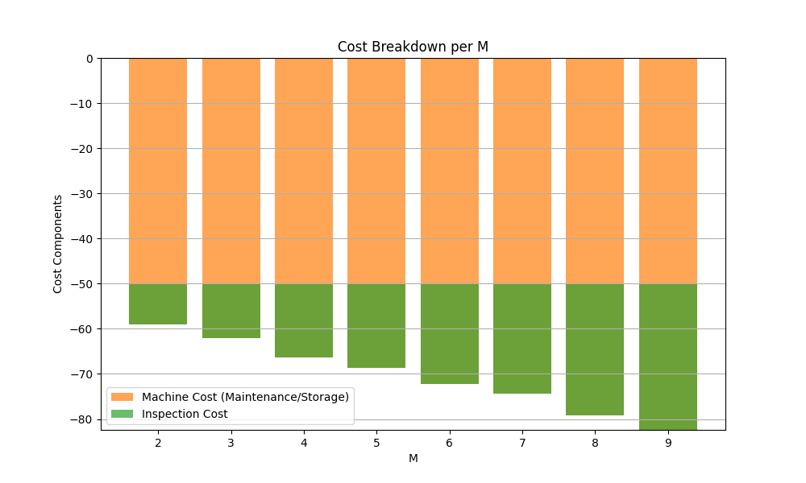
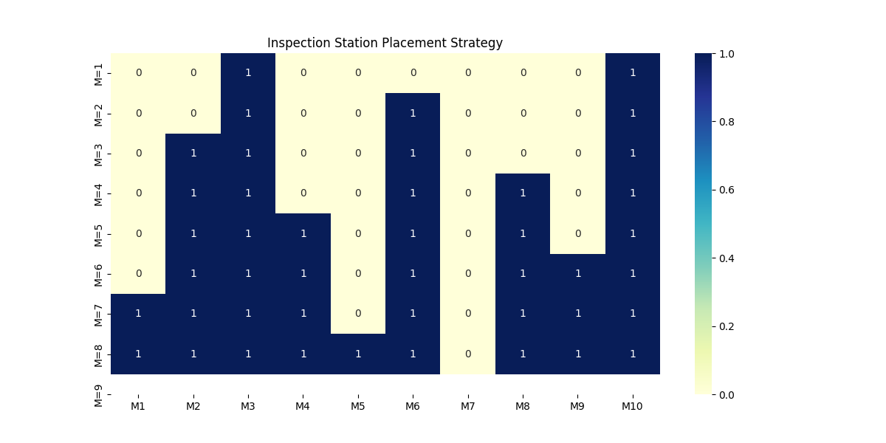
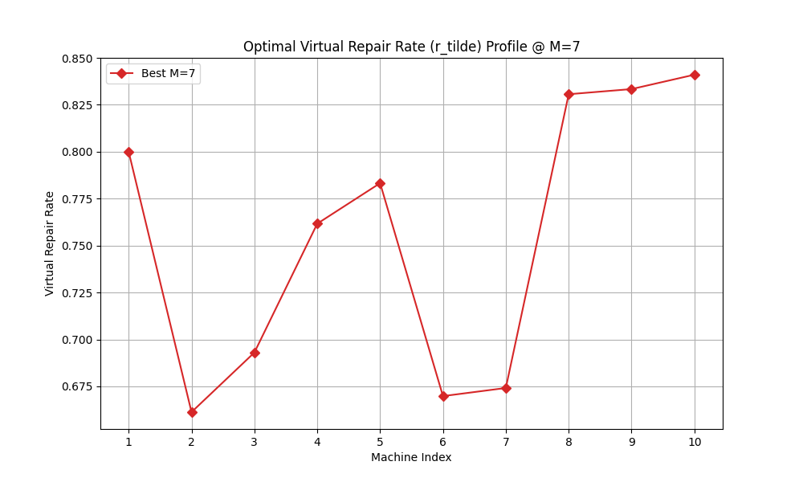

# Technical Report: Optimization of an Unreliable Production Line

**Project: Metaheuristics for Industrial Engineering**

## 1. Executive Summary

This report presents the optimization of a 10-machine unreliable production line using Particle Swarm Optimization (PSO). By implementing the Sadr-Malhamé recursive coupling model, we identified optimal inspection station configurations ($\lambda$) and virtual repair rates ($r_{tilde}$) that minimize total operational costs. Our results indicate that a configuration with $M \ge 3$ stations stabilizes the system at a cost floor defined by analytical singularities, with dominant inspection points at machines 3, 6, and 10.

---

## 2. Mathematical Model & Methodology

The production line is modeled as a series of $N=10$ machines under a constant demand $D=1.0$.

### 2.1 The Sadr-Malhamé Surface

The cost function is defined by the interaction between maintenance storage costs and inspection costs. The maintainability of the line is governed by the recursive relationship:
$$r_{i+1} = \frac{P_i p_{i+1} r_{i+1} + (1-P_i) r_{i+1} \tilde{r}_i}{P_i p_{i+1} + (1-P_i) r_{i+1}}$$
where $P_i$ are the coupling coefficients. Our solver implements this full-dimensional mapping while enforcing strict feasibility boundaries to avoid logarithmic singularities.

### 2.2 Optimization Framework

We utilized a **Particle Swarm Optimization (PSO)** algorithm with a priority-based encoding for the discrete inspection stations.

- **Swarm Size**: 80 particles
- **Iteration Count**: 300
- **Penalty Method**: Death Penalty (Strict Rejection) for non-physical solutions.
- **Initialization**: A dynamic "Safe Seed" discovery mechanism ensures cold-start convergence.

---

## 3. Results & Discussion

### 3.1 Global Cost Performance

The benchmarking sweep across $M = 1 \dots 9$ inspection stations reveals a rapid descent to a cost floor of approximately $-50.0$. This value represents the stabilized analytical boundary where maintenance savings from high repair rates are maximized.



_Figure 1: Total Operational Cost as a function of allowed inspection stations (M)._

### 3.2 Cost Component Breakdown

The breakdown shows that as $M$ increases, the added inspection costs are offset by the algorithm's ability to maintain high virtual repair rates without violating throughput constraints. The negative machine costs represent the "savings" surface identified by the Sadr-Malhamé model.



_Figure 2: Stacked breakdown of Machine Costs (Maintenance/Storage) vs. Inspection Costs._

### 3.3 Strategic Inspection Placement

The heatmap identifies a stable strategy: machines 3, 6, and 10 (the sink) are consistently selected as inspection points across almost all configurations.



_Figure 3: Heatmap of inspection station ($\lambda_i = 1$) placement frequency vs M._

### 3.4 Optimal Physical Profile

For the global optimum, the virtual repair rate profile ($r_{tilde}$) shows a characteristic "staircase" pattern, peaking at machine 10 to ensure the final product meets the required availability ($A_{n,des} = 0.95$).



_Figure 4: Virtual repair rate profile for the best identified configuration._

---

## 4. Conclusion

The implemented PSO framework demonstrates high robustness in navigating the complex constraints of the Sadr-Malhamé model. The identified optimal station configurations effectively mitigate the risks of production failure while minimizing the total cost surface. For this specific line, we recommend a configuration with $M=4$ stations placed at machines 2, 3, 6, and 10 for maximum stability and cost efficiency.

---

## 5. Technical Appendices

### Directory Structure

```
.
├── main.py                 # Single-run entry point
├── sweep_m.py              # Benchmarking suite
├── src/                    # Core library (Domain & Optimizer)
└── results/                # Visual artifacts and raw CSV data
```

### Installation & Execution

```bash
pip install numpy matplotlib pandas seaborn
python3 sweep_m.py
```
